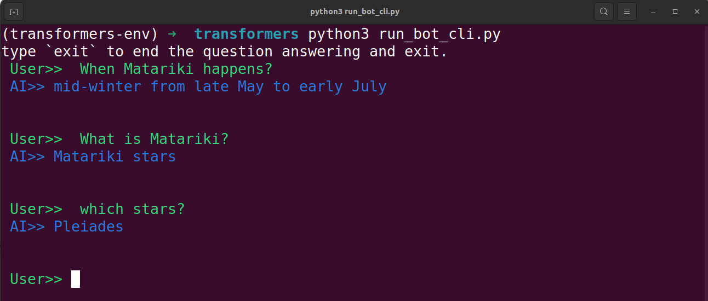
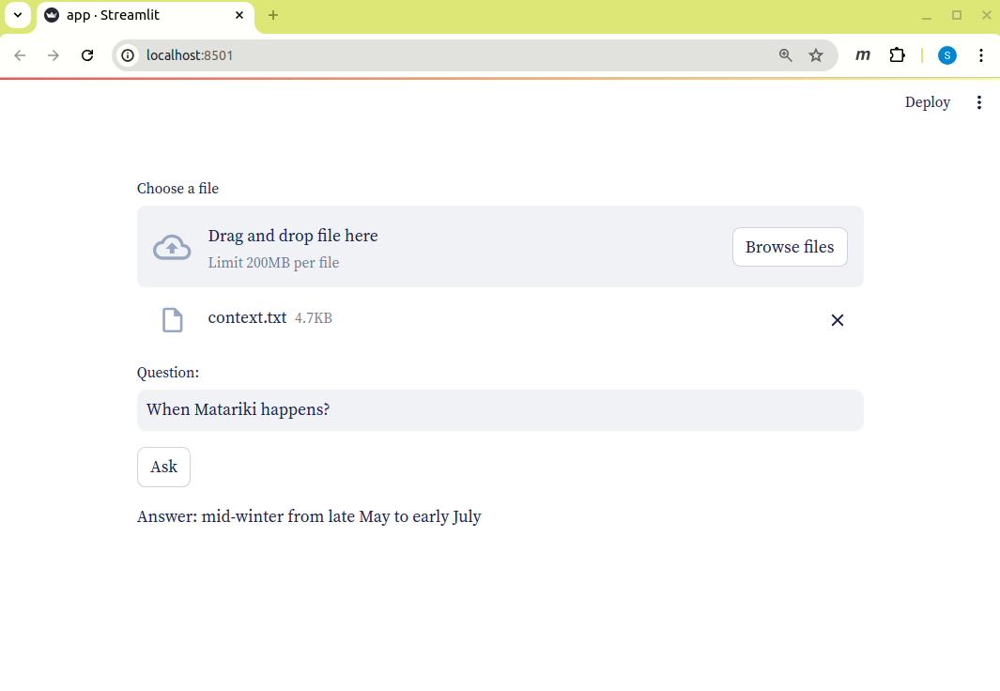

# Question Answerering Chatbot
A chatbot trained on Stanford Dataset to fine tube Google's pretrained BERT (Distilbert) model.

# Input 
Given a text file to the chat bot, you can ask it questions about the text.

# Output
 You can either use ```cli``` or the ```app``` provided here.
 
 
  
 
